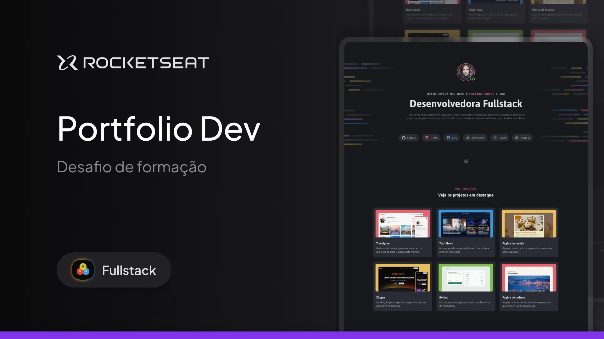

# 🌐 Portfolio Dev - Projeto Rocketseat

Este é um projeto desenvolvido durante as aulas da **Rocketseat** 🚀.  
O objetivo foi criar um **portfólio de desenvolvedora fullstack**, aplicando conceitos de **HTML** e **CSS** (com Flexbox, Grid e variáveis).

---

## 📸 Preview

---

## ✨ Funcionalidades
- Estrutura completa de portfólio:
  - 📌 Seção de introdução  
  - 📂 Projetos em destaque  
  - 🛠️ Serviços oferecidos  
  - 📬 Contato e redes sociais  
- Efeitos visuais com **hover** em botões, ícones e cards.  
- Paleta de cores definida com **variáveis CSS**. 

## 🛠️ Tecnologias utilizadas
- **HTML5**
- **CSS3**
- **Flexbox & Grid Layout**
- **Variáveis CSS**
- **Google Fonts (Asap, Inconsolata, Maven Pro)**

---

📚 Aprendizados

- Organização de código com múltiplos arquivos CSS.
- Uso de variáveis de cor e fonte para facilitar manutenção.
- Aplicação de Flexbox e Grid para estruturação do layout.
- Transições e efeitos com hover para melhorar a experiência do usuário.

📄 Licença

Projeto desenvolvido para fins educacionais durante o curso da Rocketseat.
Sinta-se à vontade para estudar e adaptar. ✨